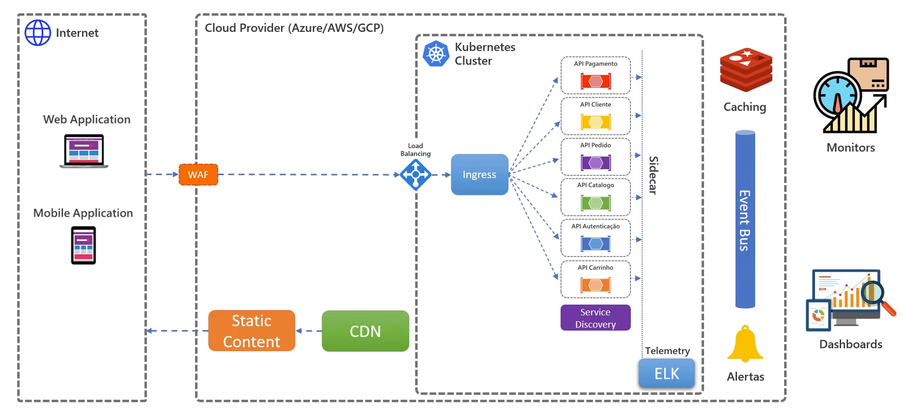
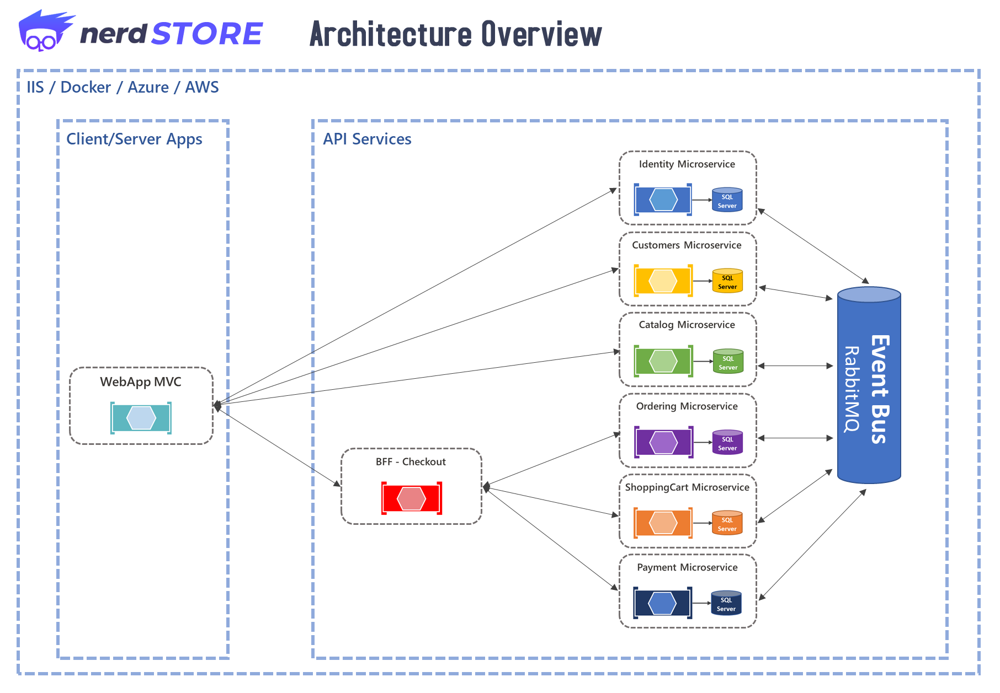
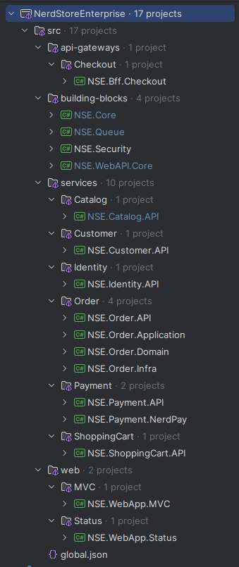
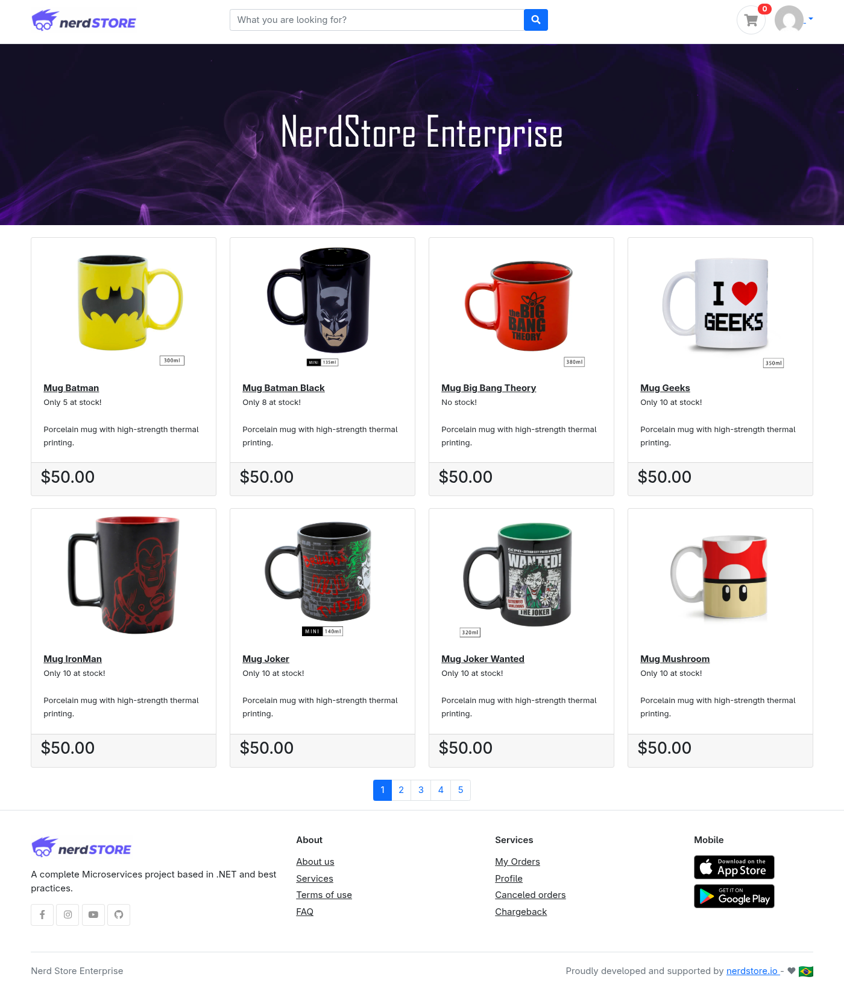
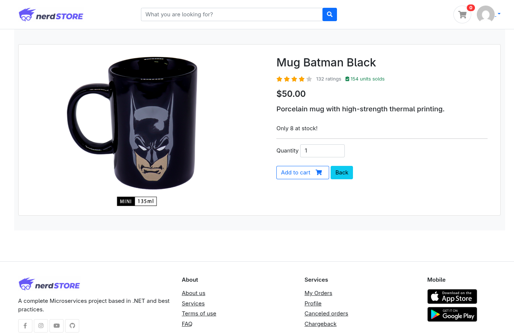
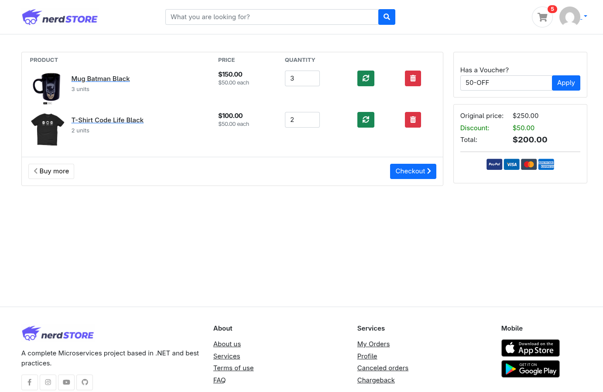
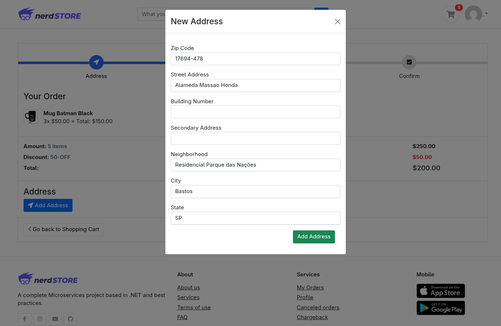
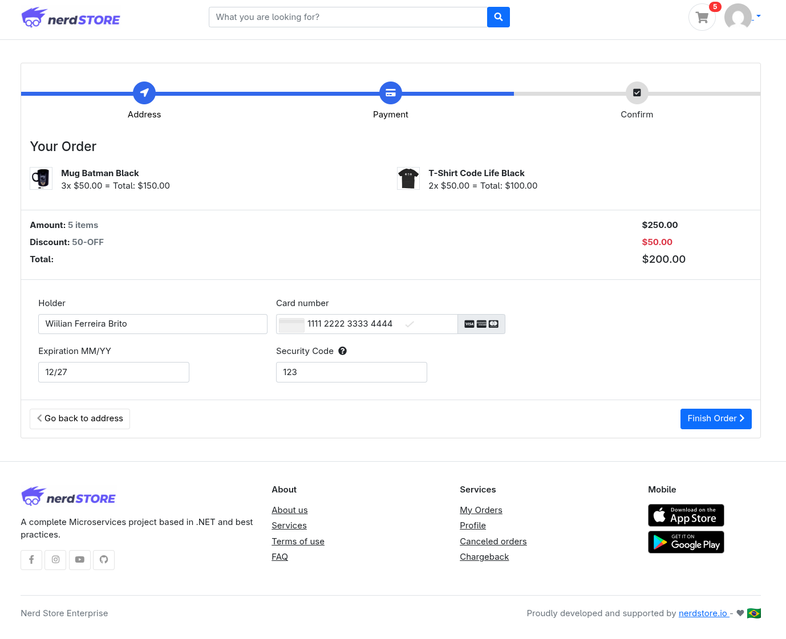
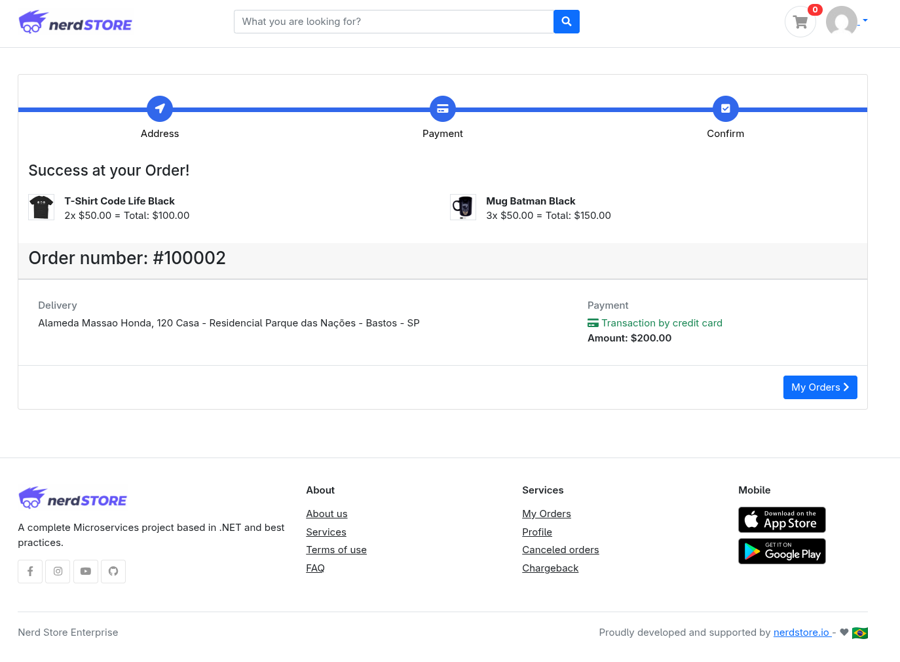
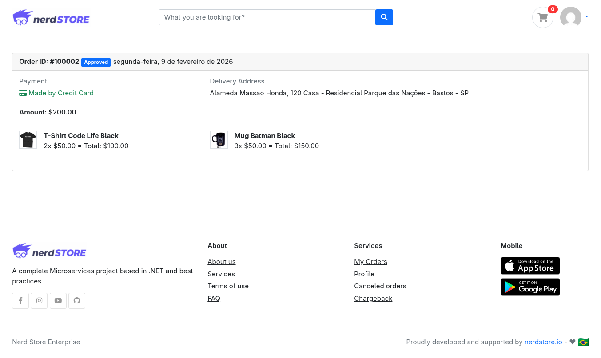

# 🛍️ Nerd Store Enterprise

<div align="center">
   
</div>


## 💻 Sobre o projeto
Este projeto consiste em uma aplicação de **e-commerce** desenvolvida com foco em boas práticas de **arquitetura de software**, separação de responsabilidades e construção de sistemas distribuídos.

Sua implementação foi baseada em diversos outros repositórios que criei voltados para **arquitetura enterprise**, com o objetivo principal de consolidar aprendizados, explorar padrões arquiteturais e demonstrar, de forma prática, como esses conceitos podem ser aplicados em um fluxo completo de compra dentro de um e-commerce.

### ⛃ Repositórios baseados
- [Fundamentos de Microsserviços](https://github.com/Willian-Brito/microservices-learning)
- [Dominando Kubertnetes](https://github.com/Willian-Brito/k8s-learning)
- [GitHub Actions](https://github.com/Willian-Brito/github-actions-learning)
- [Modelagem de Domínios Ricos](https://github.com/Willian-Brito/nerd-store)
- [Dominando Testes de Software](https://github.com/Willian-Brito/dominando-testes-de-software)

## 🎯 Arquitetura de Solução

<p align="center">
    
</p>

## 🧩 Microsserviços

Este projeto foi estruturado utilizando uma arquitetura baseada em microsserviços, contruídos em .NET 9, onde cada serviço é responsável por um conjunto específico de funcionalidades do domínio de negócio. 

<p align="center">
    
</p>

### 🔐 Identidade

Responsável pela autenticação e autorização dos usuários do sistema.

#### 🔷 Funcionalidades
- **Criação de novo usuário**
  - Permite o cadastro de novos usuários na plataforma.
  - Valida dados de entrada e regras de segurança.
  - Segurança no armazenamento de credenciais 
- **Login**
  - Autentica o usuário com base em suas credenciais.
- **Logout**
  - Encerra a sessão do usuário autenticado.
- **Geração de JWT**
  - Emite tokens de acesso para autenticação nas demais APIs.
  - Gerencia expiração do token (1 hora)
- **Refresh Token**
  - Permite renovar o token de acesso sem necessidade de novo login.
- **Validação de Token**
  - Garante que apenas requisições autenticadas acessem recursos protegidos.
- **Exposição de chaves públicas (JWKS)**
  - Disponibiliza as chaves públicas para que outros microsserviços possam validar os JWTs emitidos.
  - Permite validação distribuída e segura dos tokens.
  - Rotação de chaves públicas (90 dias)

### 👤 Clientes

Responsável pelo gerenciamento dos dados do cliente.

#### 🔷 Funcionalidades
- **Criar cliente**
  - Realiza o cadastro de novos clientes na plataforma.
- **Adicionar endereço de entrega**
  - Permite que o cliente registre endereços para envio de pedidos.

### 🛍️ Catálogo

Responsável pela gestão e consulta dos produtos disponíveis para venda.

#### Funcionalidades
- **Listar produtos**
  - Exibe os produtos disponíveis no catálogo.
- **Pesquisa de produtos paginados**
  - Permite busca eficiente com paginação.
- **Validações de estoque**
  - Verifica disponibilidade dos produtos antes da compra.
- **Baixa de estoque**
  - Reduz a quantidade disponível após confirmação de um pedido.
  - Garante consistência com o processo de venda.
- **Estorno de estoque**
  - Devolve itens ao estoque em casos de cancelamento ou falha no processamento do pedido.

### 🧺 Carrinho

Responsável pelo gerenciamento do carrinho de compras do usuário.

#### 🔷 Funcionalidades
- **CRUD de carrinho**
  - Criação, leitura, atualização e remoção de itens.
- **Aplicar cupom de desconto**
  - Permite aplicar regras promocionais ao carrinho.
- **Recalcular valores**
  - Atualiza automaticamente o total com base nos itens e descontos.
- **Validações do carrinho**
  - Garante consistência dos dados (quantidade, disponibilidade, valores).

### 📦 Pedido

Responsável pelo processamento, cancelamento e registro dos pedidos realizados.

#### 🔷 Funcionalidades
- **Processar pedidos**
  - Converte o carrinho em pedido.
  - Orquestra comunicação com pagamento e demais serviços necessários.
  - Garante persistência e rastreabilidade do fluxo de compra.
- **Cancelamento de pedido**
  - Permite cancelar pedidos conforme regras de negócio.
  - Dispara processos relacionados, como:
    - Estorno de pagamento
    - Devolução de itens ao estoque

### 💳 Pagamento

Responsável pelo processamento financeiro dos pedidos.

#### 🔷 Funcionalidades
- **Simulação de processamento de pagamentos**
  - Executa fluxo de autorização e confirmação de pagamento.
  - Retorna status da transação (aprovado, recusado, pendente).
  - Permite integração futura com gateways reais.
- **Estorno de pagamento**
  - Realiza devolução de valores em casos de cancelamento ou falha posterior.
  - Mantém registro das transações financeiras.
  - Garante rastreabilidade e consistência do fluxo financeiro.
  
### 🧭 BFF de Compras (Backend for Frontend)

Responsável por orquestrar as chamadas relacionadas ao fluxo de compra, centralizando regras e validações entre os serviços de **Carrinho**, **Pedido** e **Pagamento** para atender às necessidades do frontend.

### Responsabilidades
- Orquestrar chamadas entre:
  - Microsserviço de **Carrinho**
  - Microsserviço de **Pedido**
  - Microsserviço de **Pagamento**
- Reduzir a complexidade do frontend ao expor endpoints agregados.
- Consolidar dados necessários para a jornada de compra.
- Melhorar a experiência do cliente reduzindo múltiplas chamadas do frontend.

### 🔷 Funcionalidades
- **Iniciar checkout**
  - Valida estado atual do carrinho.
  - Garante consistência de valores e itens.
- **Validar dados do pedido**
  - Verifica endereço de entrega, disponibilidade e regras de negócio.
- **Finalizar compra**
  - Dispara o processamento do pedido.
  - Coordena o fluxo até o envio para pagamento.
- **Agregação de respostas**
  - Retorna ao frontend um modelo consolidado com informações de carrinho, totais e status do pedido.

## 🛠️ Tecnologias Utilizadas
- **Backend: Linguagens e Frameworks**
  - C#
  - .NET

- **Banco de Dados**
  - PostgreSQL
  - SQL Server

- **ORM e Data Access**
  - Entity Framework
  - Dapper

- **Testes Automatizados**
  - xUnit
  - Moq
  - Fluent Assertions

- **Comunicação de serviços**
  - HTTP
  - REST
  - gRPC
  - Eventos de filas

- **Mensagerias**
  - Background Services
  - RabbitMQ
  - EasyNetQ
  - Kafka

- **Frontend: Linguagens e Frameworks**
  - AspNet MVC
  - Razor
  - Html
  - Css
  - Javascript  
  - Bootstrap 5

- **Hosting (Containers)**
  - Docker (with composing)
  - Kubernetes (k8s)
  - NGINX  

- **Logs e Monitoramento**
  - Prometheus
  - Grafana

## 📦 Padrões de Design Implementados
- [x] SOLID
- [x] APIs REST
- [x] Clean Code
- [x] Clean Architecture
- [x] DDD - Domain Driven Design (Layers and Domain Model Pattern)
- [x] CQRS (Immediate Consistency)
- [x] Repository Pattern
- [x] Unit of Work
- [x] Auditoria de Dados
- [x] Global Error Handler
- [x] Background services para processamento de filas
- [x] Paginação de APIs
- [x] Specification Pattern
- [x] Result Pattern
- [x] Retry Pattern
- [x] Circuit Breaker
- [x] API Gateway / BFF
- [ ] Event Sourcing
- [ ] Testes Unitários
- [ ] Testes de Integração
- [ ] Testes e2e
- [ ] Rate Limiting
- [x] Conteinerização
- [ ] CI/CD Pipelines
  - [ ] Versionamento
  - [ ] Build
  - [ ] Testes Unitários
  - [ ] Gerar Docker Image
  - [ ] Subir Imagem no Docker Hub
- [ ] Security Pipeline (DevSecOps) 
  - [ ] SAST - Static Application Security Testing
  - [ ] SCA - Software Composition Analysis
  - [ ] IaC - Infra as Code
  - [ ] Security Container Scan
  - [ ] DAST - Dynamic Application Security Testing
  - [ ] Integração com DefectDojo
- [ ] Logs e Monitoramento

## 📁 Estrutura de Pastas

<p align="center">
    
</p>

## 🚀 Como executar o projeto

Você pode executar o projeto **NerdStore** em qualquer sistema operacional.  
**Certifique-se de que o Docker está instalado em seu ambiente.**  
([Instalar o Docker](https://docs.docker.com/get-docker/))

Clone o repositório do `nerd-store-enterprise` e navegue até a pasta **infra/docker**. Em seguida:

### ▶️ Se você apenas quiser executar a aplicação NerdStore no seu ambiente Docker:

```bash
docker-compose up
```

### 🏗️ Se você quiser gerar as imagens locais e executar a aplicação NerdStore no seu ambiente Docker:

Este docker-compose irá fornecer **um container de banco de dados para cada serviço de API.**

```bash
docker-compose -f docker-compose-local.yml up --build
```

### 💡 Se preferir economizar recursos, utilize o docker-compose local simplificado:

Este `docke-compose` irá fornecer **apenas um container de banco de dados para todos os serviços de API.**

```bash
docker-compose -f docker-compose-local-light.yml up --build
```

### ⚙️ Configurações para VS Code:

- Abra o VSCode no diretório raiz (onde está o arquivo da solução).
- Crie um novo `launch.json` na seção de debug do VSCode e utilize a configuração abaixo para habilitar a opção **"Start all projects"**.


```json
{
    "version": "0.2.0",
    "configurations": [
        {
            "name": "MVC WebApp",
            "type": "coreclr",
            "request": "launch",
            "preLaunchTask": "build",
            "program": "${workspaceFolder}/src/web/MVC/NSE.WebApp.MVC/bin/Debug/net9.0/NSE.WebApp.MVC.dll",
            "args": [],
            "cwd": "${workspaceFolder}/src/web/MVC/NSE.WebApp.MVC",
            "console": "internalConsole",
            "stopAtEntry": false
        },
        {
            "name": "Payment API",
            "type": "coreclr",
            "request": "launch",
            "preLaunchTask": "build",
            "program": "${workspaceFolder}/src/services/Payment/NSE.Payment.API/bin/Debug/net9.0/NSE.Payment.API.dll",
            "args": [],
            "cwd": "${workspaceFolder}/src/services/Payment/NSE.Payment.API",
            "console": "internalConsole",
            "stopAtEntry": false
        },
        {
            "name": "Catalog API",
            "type": "coreclr",
            "request": "launch",
            "preLaunchTask": "build",
            "program": "${workspaceFolder}/src/services/Catalog/NSE.Catalog.API/bin/Debug/net9.0/NSE.Catalog.API.dll",
            "args": [],
            "cwd": "${workspaceFolder}/src/services/Catalog/NSE.Catalog.API",
            "console": "internalConsole",
            "stopAtEntry": false
        },
        {
            "name": "Customer API",
            "type": "coreclr",
            "request": "launch",
            "preLaunchTask": "build",
            "program": "${workspaceFolder}/src/services/Customer/NSE.Customer.API/bin/Debug/net9.0/NSE.Customer.API.dll",
            "args": [],
            "cwd": "${workspaceFolder}/src/services/Customer/NSE.Customer.API",
            "console": "internalConsole",
            "stopAtEntry": false
        },
        {
            "name": "Identity API",
            "type": "coreclr",
            "request": "launch",
            "preLaunchTask": "build",
            "program": "${workspaceFolder}/src/services/Identity/NSE.Identity.API/bin/Debug/net9.0/NSE.Identity.API.dll",
            "args": [],
            "cwd": "${workspaceFolder}/src/services/Identity/NSE.Identity.API",
            "console": "internalConsole",
            "stopAtEntry": false
        },
        {
            "name": "Order API",
            "type": "coreclr",
            "request": "launch",
            "preLaunchTask": "build",
            "program": "${workspaceFolder}/src/services/Order/NSE.Order.API/bin/Debug/net9.0/NSE.Order.API.dll",
            "args": [],
            "cwd": "${workspaceFolder}/src/services/Order/NSE.Order.API",
            "console": "internalConsole",
            "stopAtEntry": false
        },
        {
            "name": "ShoppingCart API",
            "type": "coreclr",
            "request": "launch",
            "preLaunchTask": "build",
            "program": "${workspaceFolder}/src/services/ShoppingCart/NSE.ShoppingCart.API/bin/Debug/net9.0/NSE.ShoppingCart.API.dll",
            "args": [],
            "cwd": "${workspaceFolder}/src/services/ShoppingCart/NSE.ShoppingCart.API",
            "console": "internalConsole",
            "stopAtEntry": false
        },
        {
            "name": "BFF Checkout",
            "type": "coreclr",
            "request": "launch",
            "preLaunchTask": "build",
            "program": "${workspaceFolder}/src/api-gateways/Checkout/NSE.Bff.Checkout/bin/Debug/net9.0/NSE.Bff.Checkout.dll",
            "args": [],
            "cwd": "${workspaceFolder}/src/api-gateways/Checkout/NSE.Bff.Checkout",
            "console": "internalConsole",
            "stopAtEntry": false
        }
    ],
    "compounds": [
        {
            "name": "Start all projects",
            "configurations": [
                "MVC WebApp",
                "Payment API",
                "Catalog API",
                "Customer API",
                "Identity API",
                "Order API",
                "ShoppingCart API",
                "BFF Checkout"
            ],
            "stopAll": true
        }
    ]
}    
```

## ⚠️ Aviso importante

- Este não é um template arquitetural nem um modelo base para novas aplicações.
- Todas as implementações foram feitas pensando em cenários do mundo real, porém o objetivo principal é compartilhar conhecimento.
- Caso existam implementações em excesso, remova o que for desnecessário e procure evitar **over-engineering**.

## 🛒 Nerd Store E-commerce

#### 🖥️ Catálogo de Produtos
<div align="center">
  
</div>

#### 🖥️ Detalhes de Produtos
<div align="center">
  
</div>


#### 🖥️ Carrinho de Compras
<div align="center">
  
</div>

#### 🖥️ Adicionar Endereço de Entrega
<div align="center">
  
</div>

#### 🖥️ Adicionar Dados do Pagamento
<div align="center">
  
</div>

#### 🖥️ Pagamento Aprovado
<div align="center">
  
</div>

#### 🖥️ Meus Pedidos
<div align="center">
  
</div>


## 📝 Licença

Este projeto esta sobe a licença [MIT](https://github.com/Willian-Brito/nerd-store-enterprise/blob/main/LICENSE).

Feito com ❤️ por Willian Brito 👋🏽 [Entre em contato!](https://www.linkedin.com/in/willian-ferreira-brito/)
